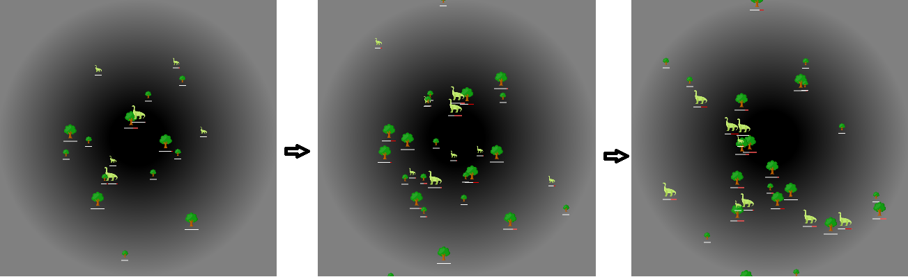

The TerrariumJS game is a Survival-of-the-Fittest Competition that allows you to program your own organism to compete against other organisms!

#Game Overview
In Terrarium, you can create herbivores, carnivores, or plants and then introduce them into an online world where they compete for survival. The goal is
creating a creature fit for survival while maintaining a healthy ecosystem.

Status: On going process!

Link for old game
This game is based on the ideas of game created long long time ago back in .net 1.0. You can check some original content here.
https://github.com/terrariumapp/terrarium
https://www.hanselman.com/blog/LearningOpportunityNETTerrariumIsBack.aspx

You do not play the game! Tha game plays you!
